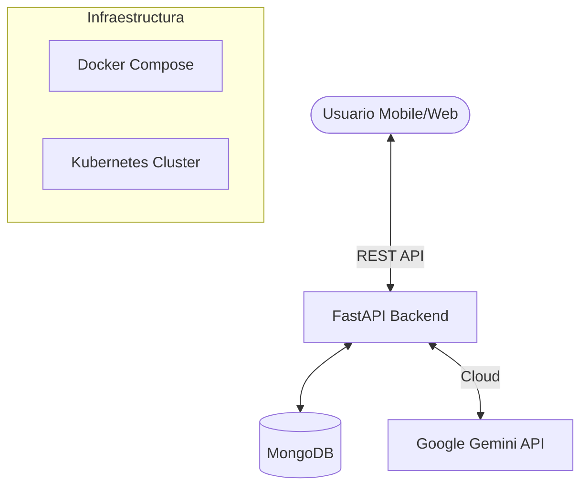

<p align="center">
  
</p>

# 👨‍🍳 ChefMate AI
> **Asistente culinario inteligente para la gestión de inventario y reducción del desperdicio de alimentos mediante IA Generativa.**

[](https://fastapi.tiangolo.com/)
[](https://reactjs.org/)
[](https://kotlinlang.org/)
[](https://www.mongodb.com/)
[](https://www.docker.com/)

ChefMate AI es un ecosistema integral diseñado para optimizar el consumo de alimentos en el hogar. El sistema utiliza modelos de lenguaje de gran escala (LLM) para transformar el inventario disponible de un usuario en recetas creativas, personalizadas según su ubicación geográfica, restricciones dietéticas y disponibilidad de tiempo.

---

## 🚀 Características Principales

### 📱 Aplicación Móvil (Consumidor)
- **Gestión de Inventario:** Registro y control de productos con seguimiento de cantidades y unidades.
- **Generación de Recetas:** Motor de IA que prioriza el uso de ingredientes próximos a vencer.
- **Personalización Regional:** Adaptación cultural de recetas (ej. Gastronomía boliviana).
- **Seguridad:** Autenticación robusta con manejo de tokens y cookies seguras.

### 💻 Panel Web (Administración)
- **Dashboard de Gestión:** Control total sobre el catálogo de productos y categorías.
- **Monitorización de IA:** Visualización de la interacción con los modelos generativos.
- **Diseño Premium:** Interfaz moderna construida con Tailwind CSS y Framer Motion.

### 🧠 Motor de IA Híbrido
- **Inferencia Local:** Soporte para [Ollama](https://ollama.com/) (Llama 3) para máxima privacidad.
- **Inferencia Cloud:** Integración con **Google Gemini 1.5 Flash** para mayor velocidad y precisión.
- **RAG Lite:** Inyección de contexto dinámico basada en el inventario actual.

---

## 🏗️ Arquitectura del Sistema



---

## 🛠️ Stack Tecnológico

| Componente | Tecnologías |
| :--- | :--- |
| **Backend** | Python 3.12, FastAPI, Pydantic, Motor (Async MongoDB) |
| **Frontend Web** | React 18, Vite, Tailwind CSS, TypeScript |
| **Mobile App** | Kotlin, Jetpack Compose, MVVM, Retrofit |
| **Base de Datos** | MongoDB |
| **IA** | Google Gemini SDK |
| **DevOps** | Docker, Kubernetes, Nginx |

---

## 📁 Estructura del Proyecto

```text
├── chefmate_backend/    # Servidor API FastAPI
├── chefmate_frontend/   # Panel de administración Web (React)
├── ChefMateApp/         # Aplicación móvil Android (Kotlin)
├── k8s/                 # Manifiestos de Kubernetes
└── docker-compose.yml   # Orquestación local
```

---

## 📦 Instalación y Despliegue

### Requisitos Previos
- Docker & Docker Compose
- Node.js & npm (para desarrollo frontend)
- Python 3.12+ (para desarrollo backend)
- Android Studio (para la App móvil)

### Inicios Rápido (Docker)
1. **Clonar el repositorio:**
   ```bash
   git clone https://github.com/Jfernand3z/ChefMate.git
   cd ChefMate
   ```

2. **Configurar variables de entorno:**
   - Copia los archivos `.env.example` (si existen) o crea un `.env` en `chefmate_backend/` con tu `GOOGLE_API_KEY`.

3. **Levantar servicios:**
   ```bash
   docker-compose up --build
   ```
   - Frontend: [http://localhost:3000](http://localhost:3000)
   - Backend API: [http://localhost:8000/docs](http://localhost:8000/docs)

### Despliegue en Kubernetes
```bash
kubectl apply -f k8s/mongo.yaml
kubectl apply -f k8s/config.yaml
kubectl apply -f k8s/backend.yaml
kubectl apply -f k8s/frontend.yaml
```

---

## ⚙️ Variables de Entorno

### Backend (`chefmate_backend/.env`)
- `SECRET_KEY`: Clave para firma de JWT.
- `GOOGLE_API_KEY`: API Key para Google Gemini.
- `MONGO_URI`: Conexión a base de datos.
- `CORS_ORIGINS`: Lista de orígenes permitidos.

### Frontend (`chefmate_frontend/chefmate_frontend/.env`)
- `VITE_API_URL`: URL base de la API.
- `VITE_RECAPTCHA_SITE_KEY`: Clave de sitio para ReCaptcha.

---